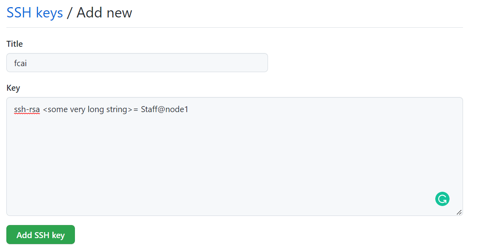
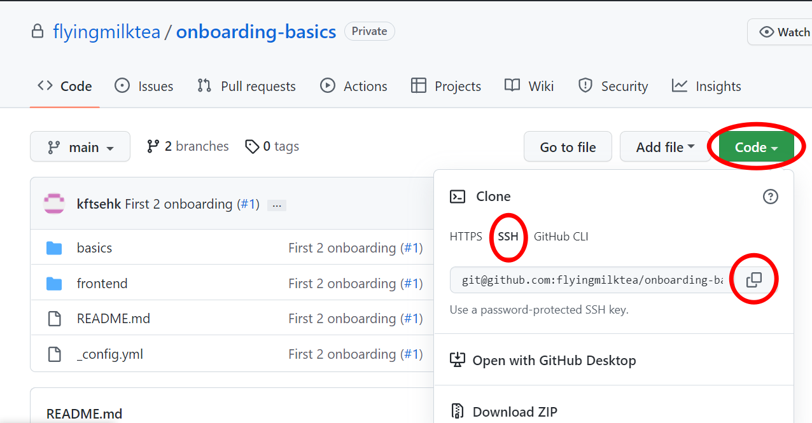

After connect to our server. You may try to clone a repo (says, this one) to the server via SSH.

# SSH key
First you have to setup ssh key on github so you are able to push to remote repo after clone.

On the linux server,   
```
cd .ssh
```
```
cat id_rsa.pub
```
Then you will see a long string starting with ```ssh-rsa``` and end with ```= <your-user-name>@<node>```. Copy the string and goto **github>Settings>SSH and GPG keys** Then you will see a green button **New SSH key** at the top right corner. Click it and fill the copied string to Key field. The title field can be anything, but we suggest you to use **fcai** as title. After filled both field, click Add SSH key.  

  

Then you can run
```
ssh -T git@github.com
```
Then type ```yes```. Then you should see
>  Hi <your Github username>! You've successfully authenticated, but Github does not provide shell access.  

If you see this message, it means the SSH key is successfully setup. Instead, if you see
>Permission denied (public key).  

That's mean it is unccessful, you may try to run through the step again or ask for help.

If successfully setup SSH key, run
```
eval $(sh-agent -s)
ssh-add ~/.ssh_/id_rsa
```
 
# Clone via SSH
Once you setup SSH key, you can try to clone to local repo. On the linux server run
```
cd ~
```
then you may choose a diretory you like to clone the repo. But in this tutorial, we will put it into Documents. Therefore run
```
cd Documents
mkdir Git
cd Git
```
Then copy the ssh link from this repo  
 
  
 
which is ```git@github.com:flyingmilktea/onboarding-basics.git```  
Then back to linux server run
```
git clone git@github.com:flyingmilktea/onboarding-basics.git
```
Now, you should successfully clone the repo to local.

# Push to remote repo
After cloning to local, run
```
git checkout <new-branch name>
```
then
```
git push -u origin <branch-name>
```
Then you should successfully push to the remote repo. If unsuccessful, you may ask for help.
